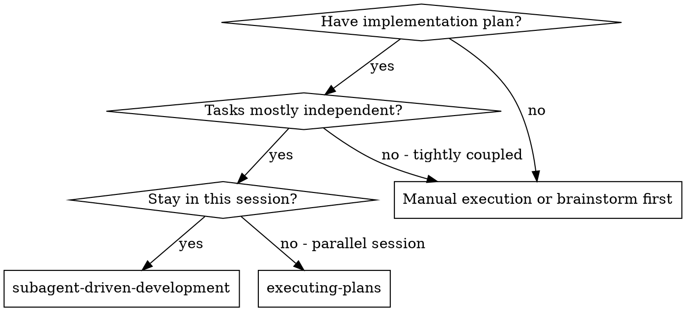
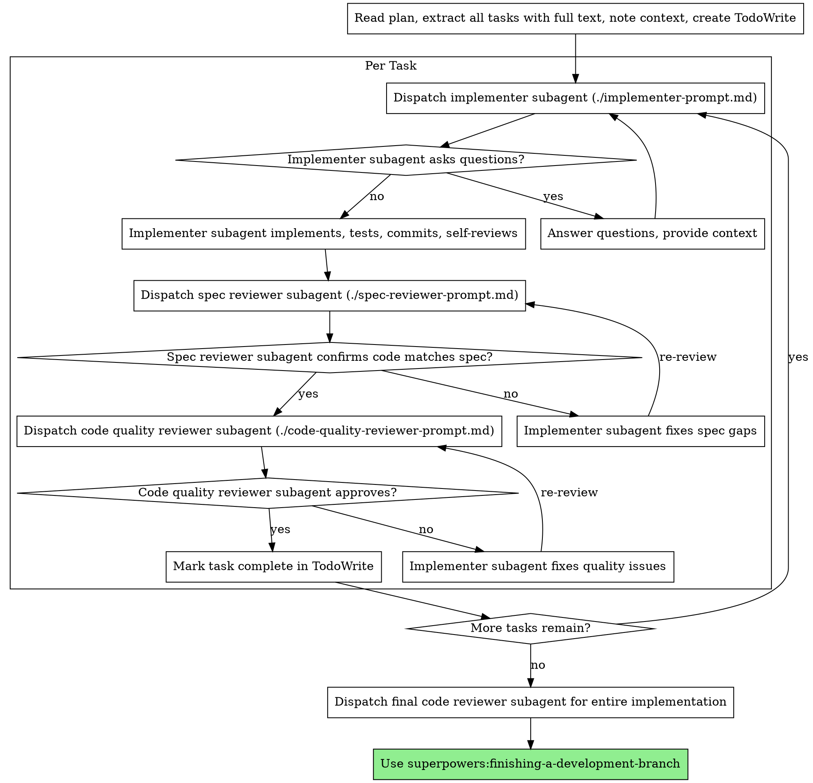

# Subagent-Driven Development

Execute plan with a contract-first gate: dispatch API contract subagent first, lock the OpenAPI contract in API MOCK, then run implementation with two-stage review (spec compliance first, then code quality).

**Why subagents:** You delegate tasks to specialized agents with isolated context. By precisely crafting their instructions and context, you ensure they stay focused and succeed at their task. They should never inherit your session's context or history — you construct exactly what they need. This also preserves your own context for coordination work.

**Core principle:** Contract gate first + focused subagents + two-stage review (spec then quality) = high quality, fast iteration

## When to Use



**vs. Executing Plans (parallel session):**
- Same session (no context switch)
- Fresh subagent per task (no context pollution)
- Two-stage review after each task: spec compliance first, then code quality
- Faster iteration (no human-in-loop between tasks)

## Contract Gate (Required for Layered Full-Stack Plans)

If the plan set is layered (`api_plan.md` + `frontend_plan.md` + `backend_plan.md`), you MUST run this gate before dispatching any frontend/backend implementer:

1. Dispatch API contract subagent (`./api-contract-subagent-prompt.md`)
2. Generate `openapi_spec.json` from `api_plan.md` (strict valid JSON, OpenAPI 3.x)
3. Generate `mock_cases_seed.json` from `api_plan.md` (baseline endpoint examples)
4. Controller synchronizes contract to API MOCK platform via existing real API interfaces (with mock case seeding) and waits for success confirmation
5. Only then dispatch frontend/backend implementers in parallel with disjoint write scopes

### Contract Sync Path (existing real API interfaces required)

The controller MUST call existing API MOCK HTTP interfaces directly (reuse first, create only if unavailable).
Do not infer interface availability by scanning repository files.
`api_mock_contract_sync.py` is deprecated in this workflow.
Use concrete tool commands (`curl`, `Invoke-RestMethod`, or equivalent) to execute real HTTP calls.
Pseudo "call x/y/z" log lines without executable command evidence are invalid.

Resolve runtime inputs first:
- `API_BASE_URL`
- `ACCESS_TOKEN` (Authorization Bearer token)
- `ABS_OPENAPI_SPEC_JSON` (absolute path)

Runtime-source rule:
- `API_BASE_URL`, `ACCESS_TOKEN`, `WORKSPACE_ID`, `TASK_ID`, `USER_ID`, `MOCK_BASE_URL` are platform runtime context inputs (injected by controller/session runtime), not repository configuration.
- Never scan task repository files/directories to discover API MOCK configuration.
- Determine interface availability by executing real HTTP calls against `API_BASE_URL`, not by file search.
- If required runtime context is missing, return `BLOCKED` with code `PLATFORM_CONTEXT_MISSING` and list missing keys.

Required API sequence:
1. Start import job  
`POST /api/workspaces/{ws_id}/api-mock/projects/{task_id}/swagger/import`
   - Request format is mandatory: `multipart/form-data` (not JSON body).
   - Provide at least one form field: `raw_content` (OpenAPI text) or `file` or `source_url`.
   - Canonical invocation shape:
     - PowerShell `Invoke-RestMethod -Method Post ... -Form @{ raw_content = (Get-Content -Raw $ABS_OPENAPI_SPEC_JSON) }`
     - curl `-F "raw_content=@/abs/path/openapi_spec.json"`
2. Poll job status until terminal  
`GET /api/workspaces/{ws_id}/api-mock/projects/{task_id}/jobs/{job_id}`
3. List endpoints of active source  
`GET /api/workspaces/{ws_id}/api-mock/projects/{task_id}/endpoints`
4. For each endpoint, trigger AI mock generation job  
`POST /api/workspaces/{ws_id}/api-mock/projects/{task_id}/endpoints/{endpoint_id}/auto-mock`
5. Poll every auto-mock job until terminal  
`GET /api/workspaces/{ws_id}/api-mock/projects/{task_id}/jobs/{job_id}`
6. Verify each endpoint has mock cases  
`GET /api/workspaces/{ws_id}/api-mock/endpoints/{endpoint_id}/mock-cases`
7. Fetch project context (including canonical mock baseline URL)  
`GET /api/workspaces/{ws_id}/api-mock/projects/{task_id}/context`
8. Distribute context to frontend/backend lanes, then start parallel implementation.

Command/API outputs MUST be captured in execution logs.
Evidence must include HTTP method, URL path, status code, and parsed key JSON fields.

Expected sync/context keys:
- `status` (must be `SUCCESS` from import job)
- `source_version_id`
- `mock_base_url`
- `endpoint_count`
- `mock_case_count`
- `endpoints_with_mock_cases`
- `endpoints_without_mock_cases`

Gate checks:
- If required API interfaces are unavailable, stop with `BLOCKED` (do not dispatch frontend/backend lanes).
- If `/swagger/import` is called with JSON body instead of `multipart/form-data`, treat it as invalid execution and retry with correct format before continuing.
- If import job status is not `SUCCESS`, stop.
- If any auto-mock job ends in non-`SUCCESS`, stop.
- If context shows `endpoint_count > 0` and `endpoints_without_mock_cases > 0`, stop.
- If context is missing `mock_base_url`, stop.
- If HTTP-call evidence is missing, stop.
- If execution record only contains pseudo "call" text (no concrete tool command + HTTP result), stop.
- If control flow asks human to provide API MOCK config manually in a normal platform task, stop and mark `BLOCKED` (`PLATFORM_CONTEXT_MISSING`) instead.

Frontend lane quality floor (Vue/Vite):
- If no test framework exists, install and wire `vitest` + `@vue/test-utils` + `jsdom` before implementing feature assertions.
- Ensure test wiring artifacts exist: runnable `package.json` test script and test config (`vitest.config.*` or equivalent).
- Minimum required artifacts: at least one API-layer test (mock-base URL/contract consumption) and one UI behavior test (component/composable interaction).
- Frontend lane cannot be `DONE` without runnable test command output.

If sync is not confirmed successful, STOP. Do not start frontend/backend implementation.

## The Process

For non-layered plans, use the standard per-task flow below.
For layered full-stack plans, run the Contract Gate first, then execute per-task flow independently in frontend/backend lanes.



## Model Selection

Use the least powerful model that can handle each role to conserve cost and increase speed.

**Mechanical implementation tasks** (isolated functions, clear specs, 1-2 files): use a fast, cheap model. Most implementation tasks are mechanical when the plan is well-specified.

**Integration and judgment tasks** (multi-file coordination, pattern matching, debugging): use a standard model.

**Architecture, design, and review tasks**: use the most capable available model.

**Task complexity signals:**
- Touches 1-2 files with a complete spec → cheap model
- Touches multiple files with integration concerns → standard model
- Requires design judgment or broad codebase understanding → most capable model

## Handling Implementer Status

Implementer subagents report one of four statuses. Handle each appropriately:

**DONE:** Proceed to spec compliance review.

**DONE_WITH_CONCERNS:** The implementer completed the work but flagged doubts. Read the concerns before proceeding. If the concerns are about correctness or scope, address them before review. If they're observations (e.g., "this file is getting large"), note them and proceed to review.

**NEEDS_CONTEXT:** The implementer needs information that wasn't provided. Provide the missing context and re-dispatch.

**BLOCKED:** The implementer cannot complete the task. Assess the blocker:
1. If it's a context problem, provide more context and re-dispatch with the same model
2. If the task requires more reasoning, re-dispatch with a more capable model
3. If the task is too large, break it into smaller pieces
4. If the plan itself is wrong, escalate to the human

**Never** ignore an escalation or force the same model to retry without changes. If the implementer said it's stuck, something needs to change.

## Prompt Templates

- `./api-contract-subagent-prompt.md` - Dispatch API contract subagent (generate + lock contract)
- `./implementer-prompt.md` - Dispatch implementer subagent
- `./spec-reviewer-prompt.md` - Dispatch spec compliance reviewer subagent
- `./code-quality-reviewer-prompt.md` - Dispatch code quality reviewer subagent

## Example Workflow

```
You: I'm using Subagent-Driven Development to execute this plan.

[Read plan file once: docs/superpowers/plans/feature-plan.md]
[Extract all 5 tasks with full text and context]
[Create TodoWrite with all tasks]

Task 1: Hook installation script

[Get Task 1 text and context (already extracted)]
[Dispatch implementation subagent with full task text + context]

Implementer: "Before I begin - should the hook be installed at user or system level?"

You: "User level (~/.config/superpowers/hooks/)"

Implementer: "Got it. Implementing now..."
[Later] Implementer:
  - Implemented install-hook command
  - Added tests, 5/5 passing
  - Self-review: Found I missed --force flag, added it
  - Committed

[Dispatch spec compliance reviewer]
Spec reviewer: ✅ Spec compliant - all requirements met, nothing extra

[Get git SHAs, dispatch code quality reviewer]
Code reviewer: Strengths: Good test coverage, clean. Issues: None. Approved.

[Mark Task 1 complete]

Task 2: Recovery modes

[Get Task 2 text and context (already extracted)]
[Dispatch implementation subagent with full task text + context]

Implementer: [No questions, proceeds]
Implementer:
  - Added verify/repair modes
  - 8/8 tests passing
  - Self-review: All good
  - Committed

[Dispatch spec compliance reviewer]
Spec reviewer: ❌ Issues:
  - Missing: Progress reporting (spec says "report every 100 items")
  - Extra: Added --json flag (not requested)

[Implementer fixes issues]
Implementer: Removed --json flag, added progress reporting

[Spec reviewer reviews again]
Spec reviewer: ✅ Spec compliant now

[Dispatch code quality reviewer]
Code reviewer: Strengths: Solid. Issues (Important): Magic number (100)

[Implementer fixes]
Implementer: Extracted PROGRESS_INTERVAL constant

[Code reviewer reviews again]
Code reviewer: ✅ Approved

[Mark Task 2 complete]

...

[After all tasks]
[Dispatch final code-reviewer]
Final reviewer: All requirements met, ready to merge

Done!
```

## Advantages

**vs. Manual execution:**
- Subagents follow TDD naturally
- Fresh context per task (no confusion)
- Parallel-safe (subagents don't interfere)
- Subagent can ask questions (before AND during work)

**vs. Executing Plans:**
- Same session (no handoff)
- Continuous progress (no waiting)
- Review checkpoints automatic

**Efficiency gains:**
- No file reading overhead (controller provides full text)
- Controller curates exactly what context is needed
- Subagent gets complete information upfront
- Questions surfaced before work begins (not after)

**Quality gates:**
- Self-review catches issues before handoff
- Two-stage review: spec compliance, then code quality
- Review loops ensure fixes actually work
- Spec compliance prevents over/under-building
- Code quality ensures implementation is well-built

**Cost:**
- More subagent invocations (implementer + 2 reviewers per task)
- Controller does more prep work (extracting all tasks upfront)
- Review loops add iterations
- But catches issues early (cheaper than debugging later)

## Layered Full-Stack Example (Contract Gate + Parallel Lanes)

```
You: I'm using Subagent-Driven Development to execute this layered plan.

[Read api_plan.md, frontend_plan.md, backend_plan.md]
[Dispatch API contract subagent -> generate openapi_spec.json]
[Controller calls real API interfaces for import/job polling]
[Controller triggers auto-mock for every endpoint and waits all auto-mock jobs SUCCESS]
[Controller calls /projects/{task_id}/context to obtain canonical mock_base_url]
[Controller shares context output with both lanes]

[Dispatch frontend implementer lane + backend implementer lane in parallel]
[Each lane still follows: implement -> spec review -> quality review -> fix loops]

[After both lanes complete]
[Dispatch final code reviewer]
Done.
```

## Red Flags

**Never:**
- Start implementation on main/master branch without explicit user consent
- Skip contract gate for layered full-stack plans
- Skip existing API interface calls for contract sync
- Skip endpoint-level auto-mock generation before parallel lanes
- Skip `/projects/{task_id}/context` retrieval before injecting frontend/backend mock base URL
- Search task repository for API MOCK URL/token/config files
- Ask user to manually provide API MOCK config as the default path
- Continue using deprecated local helper/script path
- Infer command unavailability by scanning repository files
- Continue when HTTP-call evidence is missing
- Start frontend/backend implementation before contract sync is confirmed successful
- Accept implementation as DONE without automated tests in the lane
- Skip reviews (spec compliance OR code quality)
- Proceed with unfixed issues
- Dispatch multiple implementation subagents in parallel for the same write scope
- Make subagent read plan file (provide full text instead)
- Skip scene-setting context (subagent needs to understand where task fits)
- Ignore subagent questions (answer before letting them proceed)
- Accept "close enough" on spec compliance (spec reviewer found issues = not done)
- Skip review loops (reviewer found issues = implementer fixes = review again)
- Let implementer self-review replace actual review (both are needed)
- **Start code quality review before spec compliance is ✅** (wrong order)
- Move to next task while either review has open issues

**Parallel lane rule for layered full-stack plans:**
- Exactly two implementation lanes are allowed after contract gate: frontend lane + backend lane
- Lanes must have disjoint ownership and write scopes
- Do not create a third implementation lane unless human explicitly requests it

**If subagent asks questions:**
- Answer clearly and completely
- Provide additional context if needed
- Don't rush them into implementation

**If reviewer finds issues:**
- Implementer (same subagent) fixes them
- Reviewer reviews again
- Repeat until approved
- Don't skip the re-review

**If subagent fails task:**
- Dispatch fix subagent with specific instructions
- Don't try to fix manually (context pollution)

## Integration

**Required workflow skills:**
- **superpowers:using-git-worktrees** - REQUIRED: Set up isolated workspace before starting
- **superpowers:writing-plans** - Creates the plan this skill executes
- **superpowers:requesting-code-review** - Code review template for reviewer subagents
- **superpowers:finishing-a-development-branch** - Complete development after all tasks

**Subagents should use:**
- **superpowers:test-driven-development** - Subagents follow TDD for each task

**Backend contract-sync execution (required for layered full-stack plans):**
- Call existing API MOCK HTTP interfaces directly for import, polling, endpoint listing, endpoint-level auto-mock generation, mock-case verification, and context retrieval (`GET /projects/{task_id}/context`).
- Pass absolute contract artifact paths when reading local files before API submission.
- Controller must paste key JSON fields and HTTP-call evidence into lane context.

**Alternative workflow:**
- **superpowers:executing-plans** - Use for parallel session instead of same-session execution
